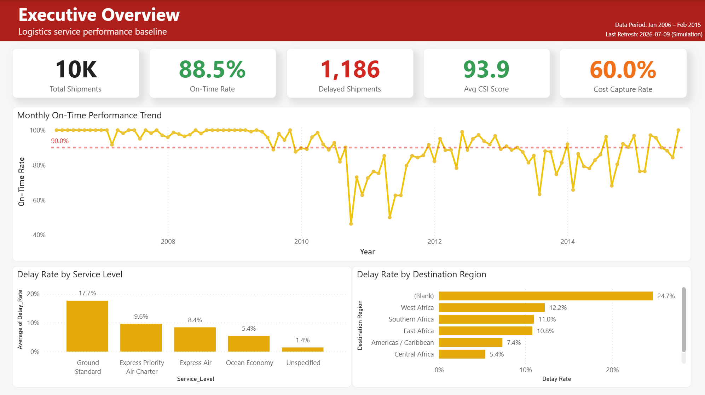
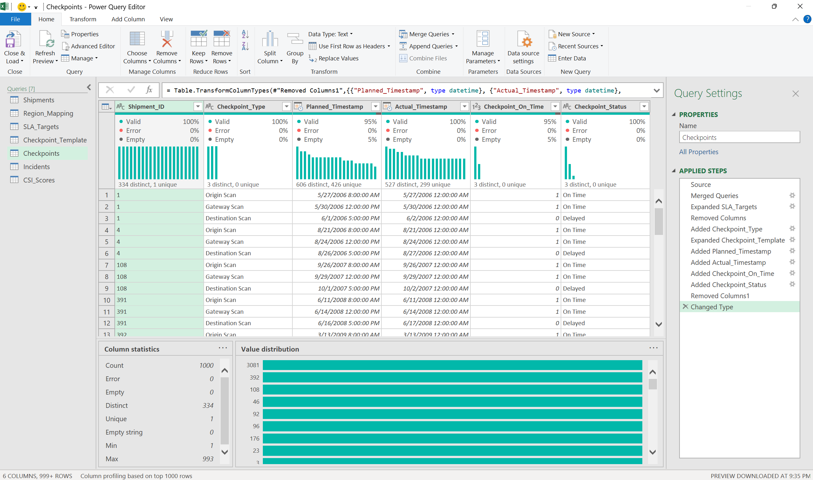
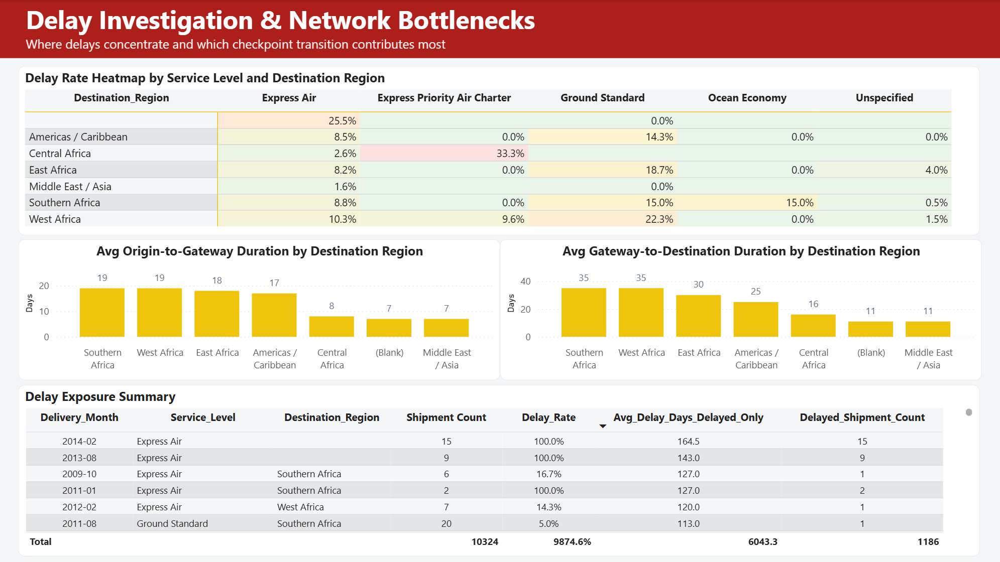
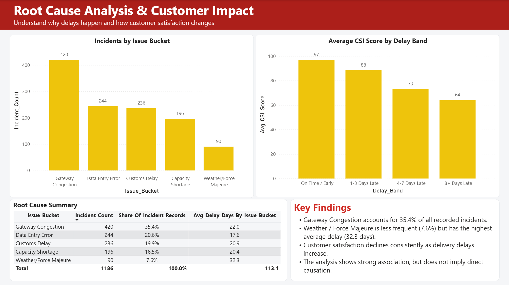
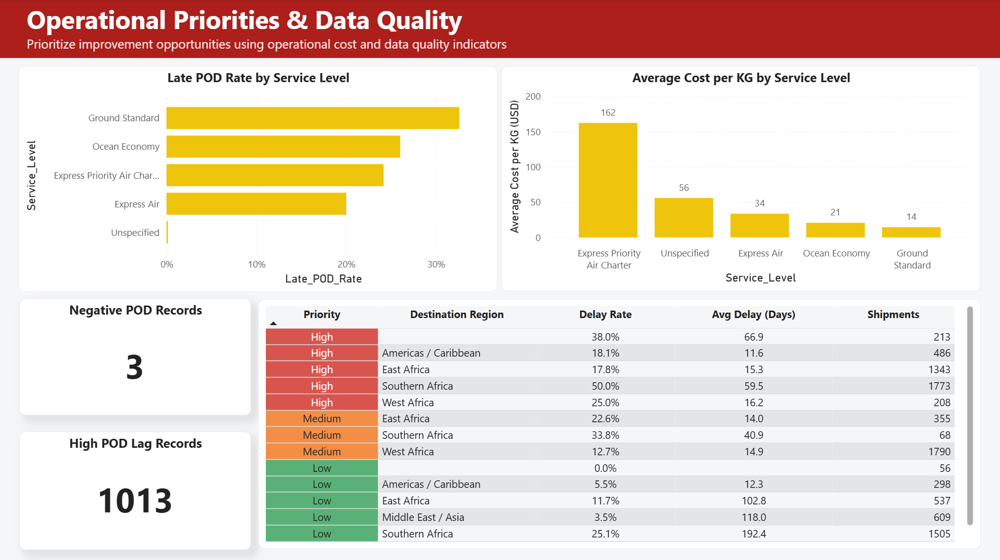

# Logistics Service Performance & Customer Experience Analytics

> Every delayed shipment tells a story.
> This project turns operational data into business decisions.




## 🚚 Overview

This is an end-to-end Business Analytics / Consulting-style case study built around logistics service performance and customer experience.

The project simulates the work of a Service Quality Analyst for an international logistics operation: starting with raw shipment data, moving through Power Query preparation, Microsoft Access SQL investigation, Power BI dashboarding, and ending with business recommendations.

The focus is not only dashboard design. The goal is to connect operational performance, root causes, customer experience, cost visibility, and data quality into a decision-ready business story.

## ✨ Project Highlights

| Highlight | Result |
|---|---:|
| Shipments analyzed | 10,324 |
| Power BI dashboard pages | 4 |
| Microsoft Access SQL queries | 9 |
| Analytical tables | 5 |
| ETL layer | Power Query |
| Final deliverable | Business recommendations included |

## 🎯 Why This Project Exists

Most dashboards show what happened. This project investigates why it happened and what the business should do next.

It follows a full analytical lifecycle: frame the business problem, prepare the data, model the operation, investigate with SQL, tell the story in Power BI, and translate findings into practical recommendations.

The case connects five business themes:

- Service quality
- Operational bottlenecks
- Root Cause Analysis
- Customer experience
- Cost and data quality visibility

## 🔄 Analytics Workflow

```text
Raw CSV
-> Excel + Power Query
-> Analytical Data Model
-> Microsoft Access SQL Investigation
-> Power BI Dashboard
-> Business Recommendations
```



## 📊 Dashboard Story

| Page | Business Question | What It Shows |
|---|---|---|
| Executive Overview | How is the network performing? | Shipment volume, On-Time Rate, CSI Score, Cost Capture Rate, and Delay Rate by segment |
| Operational Bottlenecks | Where are delays concentrated? | Delay hotspots and checkpoint bottlenecks, including Gateway-to-Destination performance |
| Root Cause Analysis & Customer Impact | What is driving delays? | Incident Issue Buckets and CSI Score by delay severity in the simulated model |
| Operational Priorities & Data Quality | What should managers act on? | POD timeliness, cost visibility, and corrective action priority segments |








## 🔎 Key Business Insights

- Gateway Congestion accounts for 35.4% of incident records.
- Gateway-to-Destination is the key checkpoint bottleneck in the final dashboard.
- Weather / Force Majeure is less frequent but has the highest average delay.
- CSI Score declines by delay band in the deterministic simulated model, so it should not be interpreted as real-world causality.
- Cost Capture Rate is important before interpreting cost per move.
- POD timeliness exceptions should remain visible instead of being hidden during reporting.

## ✅ Business Recommendations

The final recommendations translate the analysis into a practical management agenda:

- Improve gateway operations.
- Reduce data entry errors.
- Improve POD timeliness.
- Monitor high-cost service levels.
- Establish KPI governance.

Read the final business deliverable: [Business Recommendations](docs/business-case/05-business-recommendations.md).

## 🧰 Tech Stack

| Layer | Tools |
|---|---|
| Data preparation | Excel, Power Query |
| Database and investigation | Microsoft Access, Access SQL |
| Dashboard and semantic model | Power BI, DAX |
| Documentation | Markdown |

## 📁 Repository Structure

```text
.
|-- access/
|-- data/
|-- docs/
|-- excel/
|-- json/
|-- powerbi/
|-- screenshots/
`-- README.md
```

## 📚 Documentation

### Business Case

- [Executive Brief](docs/business-case/00-executive-brief.md)
- [Business Understanding](docs/business-case/01-business-understanding.md)
- [Analysis Plan](docs/business-case/04-analysis-plan.md)
- [Business Recommendations](docs/business-case/05-business-recommendations.md)

### Data & Modeling

- [Data Quality Assessment](docs/data-quality-assessment.md)
- [Analytical Data Model](docs/data-model.md)
- [Column Selection](docs/column-selection.md)

### SQL Investigation

- [SQL Investigation Framework](docs/sql-investigation/00-sql-investigation-framework.md)
- [SQL Query Plan](docs/sql-investigation/01-sql-query-plan.md)
- [SQL Implementation Plan](docs/sql-investigation/02-sql-implementation-plan.md)
- [SQL Validation Report](docs/sql-investigation/03-sql-validation-report.md)

### Power BI

- [Power BI Dashboard Design](docs/power-bi/04-powerbi-design.md)
- [Power BI Dashboard Build Specification](docs/power-bi/05-dashboard-build-spec.md)

## 🧠 What I Practiced

- Business problem framing
- Data cleaning and validation
- Analytical data modeling
- SQL investigation
- Power BI dashboard storytelling
- KPI design
- Recommendation writing

## ⚠️ Limitations

- The dataset is simulated/reframed from a public supply chain dataset.
- Checkpoints, incidents, and CSI Score are deterministic enrichments for the analytical case.
- Findings are directionally useful, not operational benchmarks for a specific logistics network.
- Recommendations should be validated with real operational data before implementation.

## 👋 About This Project

This project was built as a portfolio case study to demonstrate end-to-end business analytics thinking for service quality, operations, and customer experience analysis.

---

<p align="center">
  End-to-End Business Analytics Case Study
</p>

<p align="center">
  © 2026 • Designed & developed by <strong>Ky Nguyen</strong>
</p>