# Analytical Data Model

## Purpose

A multi-table analytical model was created instead of keeping all fields in a single shipment table so the project can represent different business processes separately: shipment facts, SLA targets, operational checkpoints, service incidents, and customer satisfaction.

The additional tables simulate operational data commonly available in an express logistics environment. This structure supports more realistic relationship modeling, KPI calculation, root cause analysis, and dashboard reporting than a single flat table.

## Data Model Overview

The analytical model contains five tables:

- `tbl_Shipments`: Core shipment table containing destination, routing, service level, delivery dates, cost, weight, and engineered performance fields.
- `tbl_SLA_Targets`: Lookup table defining expected transit targets by service level and destination region.
- `tbl_Checkpoints`: Operational checkpoint table used to analyze shipment progress through key handling events.
- `tbl_Incidents`: Shipment-level exception table used to analyze service failures and operational root causes.
- `tbl_CSI_Scores`: Shipment-level customer satisfaction table used to connect delivery performance with customer experience.

## ER Diagram

```mermaid
erDiagram
    tbl_SLA_Targets ||--o{ tbl_Shipments : "Service_Level + Destination_Region"
    tbl_Shipments ||--|{ tbl_Checkpoints : has
    tbl_Shipments ||--o| tbl_Incidents : may_have
    tbl_Shipments ||--|| tbl_CSI_Scores : has

    tbl_Shipments {
        string Shipment_ID PK
        string Service_Level FK
        string Destination_Region FK
    }

    tbl_SLA_Targets {
        string Service_Level PK
        string Destination_Region PK
    }

    tbl_Checkpoints {
        string Shipment_ID PK,FK
        string Checkpoint_Type PK
    }

    tbl_Incidents {
        string Shipment_ID PK,FK
    }

    tbl_CSI_Scores {
        string Shipment_ID PK,FK
    }
```

`tbl_Shipments` is the central shipment-level fact table. `tbl_SLA_Targets` stores service commitment rules. `tbl_Checkpoints` records planned vs actual operational milestones. `tbl_Incidents` stores root-cause classification for delayed shipments. `tbl_CSI_Scores` stores customer satisfaction scores.

## Relationships

`tbl_Shipments`

1 ---- * `tbl_Checkpoints`

Each shipment can have multiple checkpoint records. Each checkpoint belongs to one shipment.

`tbl_Shipments`

1 ---- 0..1 `tbl_Incidents`

Each shipment can have zero or one incident record. Each incident belongs to one shipment.

`tbl_Shipments`

1 ---- 1 `tbl_CSI_Scores`

Each shipment has one customer satisfaction score record. Each score belongs to one shipment.

`tbl_SLA_Targets`

1 ---- * `tbl_Shipments`

This relationship uses `Service_Level` + `Destination_Region`. Each SLA target can apply to many shipments, while each shipment maps to one SLA target combination.

## Primary Keys

`tbl_Shipments`

- `Shipment_ID`

`tbl_SLA_Targets`

- `Service_Level` + `Destination_Region`

`tbl_Checkpoints`

- `Shipment_ID` + `Checkpoint_Type`

`tbl_Incidents`

- `Shipment_ID`

`tbl_CSI_Scores`

- `Shipment_ID`

## Cardinality Validation

- `tbl_Shipments`: 10,324 unique `Shipment_ID` values.
- `tbl_Checkpoints`: exactly 3 checkpoint records per shipment.
- `tbl_Incidents`: one record per delayed shipment only.
- `tbl_CSI_Scores`: exactly one score per shipment.
- `tbl_SLA_Targets`: no duplicate `Service_Level` + `Destination_Region` combinations.

`tbl_Checkpoints` was validated after regeneration and is intended to support checkpoint segment duration analysis, not artificial checkpoint SLA compliance.

## Design Decisions

SLA targets are stored as a lookup table so service expectations can be managed separately from shipment records. This avoids repeating target values across the shipment table and supports cleaner reporting by service level and region.

Checkpoints are generated using a checkpoint template and cross join so each shipment follows a consistent operational event structure. This makes checkpoint analysis repeatable and refreshable.

Synthetic datasets are deterministic instead of using `RAND()` so refreshes produce stable outputs. This keeps the model reliable for Access relationships, Power BI reporting, and project review.

The gateway checkpoint is intentionally modeled as the primary operational bottleneck because gateway processing is a common point of delay in express logistics networks.

Customer satisfaction scores decrease consistently with transit delay so the model reflects a clear business relationship between delivery performance and customer experience.

## Future Usage

This data model is designed for:

- Microsoft Access relationships
- Power BI star-schema style reporting
- KPI calculation
- Root cause analysis
- Customer satisfaction analysis
