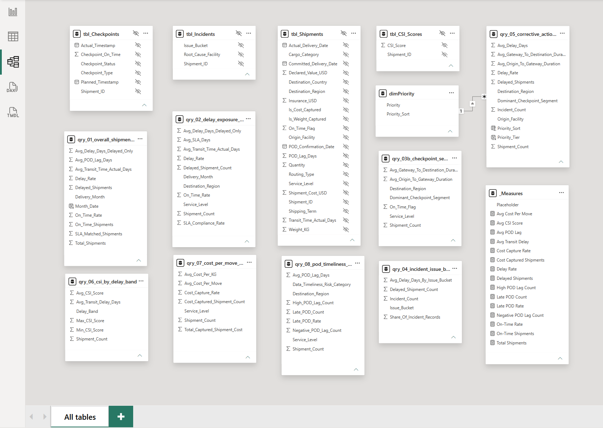
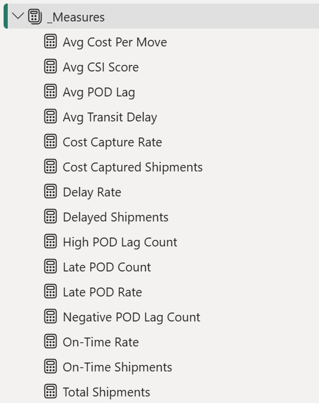

# Power BI Dashboard Build Specification

## 1. Purpose

This document records the completed Power BI dashboard build. It defines the final page layout, visual placement, source queries, formatting rules, interactions, and QA checks used in the implemented dashboard.

The build remains SQL-first: Power BI consumes validated Microsoft Access query outputs and avoids unnecessary model complexity.

Final implementation screenshots:





## 2. Global Build Rules

- Use 16:9 canvas size: 1366 x 768.
- Use page background `#F5F6F8` and white visual cards `#FFFFFF`.
- Keep all pages visually consistent.
- Use validated Access SQL outputs as source tables.
- Hide raw base tables from Report view unless needed for a KPI measure.
- Avoid unnecessary relationships.
- Use rate metrics with volume metrics.
- Do not use 3D visuals, gauges, or decorative visuals.
- Do not overuse slicers.
- Keep limitations visible but concise.

Design system:

- Border: `#E6E8EB`
- Title text: `#222222`
- Secondary text: `#666666`
- Accent yellow: `#F4C400`
- Accent red: `#D92D20`
- Success green: `#1F9D55`
- Outer margin: 24 px
- Gap between cards/visuals: 16 px
- Card corner radius: 8 px
- Light shadow only if available
- Font: Segoe UI or default Power BI font

## 3. Aggregation and Grain Rules

- Some Access queries are pre-aggregated at different grains.
- Power BI visuals must not average pre-aggregated percentages unless explicitly weighted.
- KPI cards should use dedicated DAX measures where needed.
- Rate measures should use ratio-of-sums logic.
- Average-of-average should be avoided unless the visual grain matches the query grain.

Required DAX guidance:

```DAX
Avg CSI Score =
DIVIDE(
    SUMX(qry_06_csi_by_delay_band, qry_06_csi_by_delay_band[Shipment_Count] * qry_06_csi_by_delay_band[Avg_CSI_Score]),
    SUM(qry_06_csi_by_delay_band[Shipment_Count])
)
```

```DAX
Cost Capture Rate =
DIVIDE(
    SUM(qry_07_cost_per_move_by_service_level[Cost_Captured_Shipment_Count]),
    SUM(qry_07_cost_per_move_by_service_level[Shipment_Count])
)
```

```DAX
Delay Rate =
DIVIDE(
    SUM(qry_02_delay_exposure_by_service_region[Delayed_Shipment_Count]),
    SUM(qry_02_delay_exposure_by_service_region[Shipment_Count])
)
```

V07, V08, V09, and V12 should use the `Delay Rate` measure when aggregating above the original query grain.

## 4. Page Navigation

- Use buttons or text navigation on each page.
- Navigation order: Executive Overview -> Operational Bottlenecks -> Root Cause Analysis & Customer Impact -> Operational Priorities & Data Quality.
- Place navigation at top-right.
- Keep page titles at top-left.
- Navigation buttons: X=980, Y=16, W=360, H=32.
- Use text buttons: Executive | Bottlenecks | Root Cause | Priorities.
- Active page button uses accent yellow underline.
- Keep navigation consistent across all pages.

## 5. Page Layout Grid

- Header: X=24, Y=16, W=1318, H=56
- Main content starts at Y=88
- Footer/notes area near bottom if needed
- Use 16 px gaps

## 6. Slicer Placement

Global slicer area:

- Place slicers near top-right under navigation or as compact dropdowns.
- Suggested position: X=980, Y=16, W=360, H=48.
- Slicer style: dropdown, compact.
- Use no more than 2-3 slicers per page.

Page-specific slicers:

- Page 1: `Service_Level`, `Destination_Region`; optional `Delivery_Month`.
- Page 2: `Service_Level`, `Destination_Region`.
- Page 3: `Issue_Bucket` if needed.
- Page 4: `Priority_Tier`; optional cost capture status if available.

## 7. Page 1 - Executive Overview


Header:

- X=24, Y=16, W=900, H=48
- Title: "Executive Overview"
- Subtitle: "Logistics service performance baseline"

### V01 Total Shipments

- Position: X=24, Y=88, W=246, H=90
- Visual: KPI card
- Business question: What is the overall shipment performance?
- SQL source: `qry_01_overall_shipment_performance`
- Purpose: Show total shipment volume.
- Fields: `Total_Shipments`
- Formatting notes: White card, bold KPI value, title text `#222222`.
- Interaction notes: Keep as page-level summary; avoid distracting cross-filter behavior.

### V02 On-Time Rate

- Position: X=286, Y=88, W=246, H=90
- Visual: KPI card
- Business question: What is the overall shipment performance?
- SQL source: `qry_01_overall_shipment_performance`
- Purpose: Show overall on-time performance.
- Fields: `On_Time_Rate`
- Formatting notes: Percentage with 1 decimal place; use success green for strong performance and accent red for risk if conditional formatting is applied.
- Interaction notes: Should reflect active global slicers.

### V03 Delayed Shipments

- Position: X=548, Y=88, W=246, H=90
- Visual: KPI card
- Business question: What is the overall shipment performance?
- SQL source: `qry_01_overall_shipment_performance`
- Purpose: Show delayed shipment volume alongside the on-time rate.
- Fields: `Delayed_Shipments`
- Formatting notes: Whole number with thousands separator.
- Interaction notes: Pair interpretation with rate metrics.

### V04 Avg CSI Score (0-100)

- Position: X=810, Y=88, W=246, H=90
- Visual: KPI card
- Business question: How does transit delay affect CSI score?
- SQL source: `qry_06_csi_by_delay_band`
- Purpose: Show average customer satisfaction score on a 0-100 scale.
- Fields: Weighted Avg CSI Score measure
- Formatting notes: 1 decimal place; label clearly as 0-100.
- Interaction notes: Do not imply causal impact from the KPI alone. Do not drag raw `Avg_CSI_Score` directly into the KPI card.

### V05 Cost Capture Rate

- Position: X=1072, Y=88, W=270, H=90
- Visual: KPI card
- Business question: How does cost per move vary by service level?
- SQL source: `qry_07_cost_per_move_by_service_level`
- Purpose: Show cost data coverage before cost interpretation.
- Fields: Cost Capture Rate measure
- Formatting notes: Percentage with 1 decimal place.
- Interaction notes: Use with cost visuals to avoid overreading partial capture. Do not drag raw `Cost_Capture_Rate` directly into the KPI card.

### V06 Monthly On-Time Performance Trend

- Position: X=24, Y=194, W=1318, H=280
- Visual: Line chart
- Business question: What is the overall shipment performance?
- SQL source: `qry_01_overall_shipment_performance`
- Purpose: Show performance trend over delivery month.
- Fields: Axis `Delivery_Month`; Values `On_Time_Rate`
- Formatting notes: Optional 90% reference line; use accent yellow for trend line.
- Interaction notes: Allow month selection to filter lower visuals if useful.

### V07 Delay Rate by Service Level

- Position: X=24, Y=490, W=640, H=220
- Visual: Clustered column chart
- Business question: Which service levels or regions have the highest delay exposure?
- SQL source: `qry_02_delay_exposure_by_service_region`
- Purpose: Compare delay exposure across service levels.
- Fields: Axis `Service_Level`; Values `Delay Rate` measure
- Formatting notes: Sort descending by `Delay Rate`; tooltip should include `Shipment_Count`, `Delayed_Shipment_Count`, and `Avg_Delay_Days_Delayed_Only`.
- Interaction notes: Cross-filter region visual if it remains intuitive.

### V08 Delay Rate by Destination Region

- Position: X=680, Y=490, W=662, H=220
- Visual: Horizontal bar chart
- Business question: Which service levels or regions have the highest delay exposure?
- SQL source: `qry_02_delay_exposure_by_service_region`
- Purpose: Compare delay exposure across destination regions.
- Fields: Axis `Destination_Region`; Values `Delay Rate` measure
- Formatting notes: Sort descending by `Delay Rate`; label blank values as unclassified in notes. Tooltip should include `Shipment_Count`, `Delayed_Shipment_Count`, and `Avg_Delay_Days_Delayed_Only`.
- Interaction notes: Cross-filter service level visual if it remains intuitive.

Footer:

- Position: X=24, Y=724, W=1318, H=28
- Text: "Simulated/reframed dataset - see Data Quality notes for limitations."

## 8. Page 2 - Operational Bottlenecks


Header:

- X=24, Y=16, W=900, H=48
- Title: "Operational Bottlenecks"
- Subtitle: "Where delays concentrate and which checkpoint transition contributes most"

### V09 Delay Rate Heatmap

- Position: X=24, Y=88, W=1318, H=260
- Visual: Matrix with conditional formatting
- Business question: Which service levels or regions have the highest delay exposure?
- SQL source: `qry_02_delay_exposure_by_service_region`
- Purpose: Show delay exposure by service and region.
- Fields: Rows `Destination_Region`; Columns `Service_Level`; Values `Delay Rate` measure
- Formatting notes: Apply low-to-high risk conditional formatting; tooltip should include `Shipment_Count`, `Delayed_Shipment_Count`, and `Avg_Delay_Days_Delayed_Only`.
- Interaction notes: Use as the main filter driver for Page 2.

### V10 Origin-to-Gateway Duration

- Position: X=24, Y=364, W=640, H=180
- Visual: Clustered column chart
- Business question: Which operational checkpoint contributes most to shipment delay?
- SQL source: `qry_03b_checkpoint_segment_summary`
- Purpose: Compare origin-to-gateway segment duration.
- Fields: Axis `Destination_Region`; Values `Avg_Origin_To_Gateway_Duration`
- Formatting notes: Keep units clear as days or hours based on query output.
- Interaction notes: Respond to heatmap selections if interactions remain understandable.

### V11 Gateway-to-Destination Duration

- Position: X=680, Y=364, W=662, H=180
- Visual: Clustered column chart
- Business question: Which operational checkpoint contributes most to shipment delay?
- SQL source: `qry_03b_checkpoint_segment_summary`
- Purpose: Compare gateway-to-destination segment duration.
- Fields: Axis `Destination_Region`; Values `Avg_Gateway_To_Destination_Duration`
- Formatting notes: Use same axis and scale style as V10 for comparison.
- Interaction notes: Respond to heatmap selections if interactions remain understandable.

### V12 Delay Exposure Detail Table

- Position: X=24, Y=560, W=1318, H=160
- Visual: Table
- Business question: Which service levels or regions have the highest delay exposure?
- SQL source: `qry_02_delay_exposure_by_service_region`
- Purpose: Provide detail behind delay exposure visuals.
- Fields: `Delivery_Month`, `Service_Level`, `Destination_Region`, `Shipment_Count`, `Delayed_Shipment_Count`, `Delay Rate` measure, `Avg_Delay_Days_Delayed_Only`
- Formatting notes: Conditional formatting on `Delay Rate`; sort by delay rate and shipment count.
- Interaction notes: Use as investigation table, not the primary executive view.

Footer:

- Position: X=24, Y=724, W=1318, H=28
- Text: "Simulated/reframed dataset - interpret patterns as analytical model outputs."

## 9. Page 3 - Root Cause Analysis & Customer Impact


Header:

- X=24, Y=16, W=900, H=48
- Title: "Root Cause Analysis & Customer Impact"
- Subtitle: "Incident patterns and customer satisfaction impact"

### V13 Incident Issue Bucket

- Position: X=24, Y=88, W=640, H=280
- Visual: Horizontal bar chart
- Business question: What are the most common incident issue buckets?
- SQL source: `qry_04_incident_issue_bucket_summary`
- Purpose: Rank incident categories among delayed shipments.
- Fields: Axis `Issue_Bucket`; Values `Incident_Count`; Tooltip `Share_Of_Incident_Records`, `Avg_Delay_Days_By_Issue_Bucket`
- Formatting notes: Sort descending by `Incident_Count`; show share in tooltip, not necessarily as a label.
- Interaction notes: Can filter V16 narrative cards if useful.

### V14 Avg CSI Score by Delay Band

- Position: X=680, Y=88, W=662, H=280
- Visual: Clustered column chart
- Business question: How does transit delay affect CSI score?
- SQL source: `qry_06_csi_by_delay_band`
- Purpose: Show CSI pattern by delay severity.
- Fields: Axis `Delay_Band`; Values `Avg_CSI_Score`
- Formatting notes: Sort delay bands logically: On Time / Early -> 1-3 Days Late -> 4-7 Days Late -> 8+ Days Late. Label CSI as 0-100.
- Interaction notes: Do not imply causality; present as a simulated model pattern.

### V15 Customer Impact Narrative

- Position: X=24, Y=384, W=1318, H=130
- Visual: Text box or smart narrative
- Business question: How does transit delay affect CSI score?
- SQL source: `qry_06_csi_by_delay_band`
- Purpose: Summarize how CSI declines as delay severity increases.
- Fields: Use validated CSI by delay band outputs.
- Formatting notes: Keep narrative concise; mention simulated model and no causal claim.
- Interaction notes: If smart narrative becomes unstable, use a static text box with manually reviewed wording.

### V16 Key Findings

- Position: X=24, Y=530, W=1318, H=190
- Visual: Text cards or multi-row card
- Business question: What are the main root-cause and customer impact findings?
- SQL source: `qry_04_incident_issue_bucket_summary`, `qry_06_csi_by_delay_band`
- Purpose: Capture concise insight placeholders for portfolio storytelling.
- Fields:
  - Most frequent incident issue bucket
  - Highest-severity issue bucket by average delay days
  - Customer impact pattern by delay band
- Formatting notes: Use short text blocks with clear labels.
- Interaction notes: V16 is curated static text or manually reviewed text cards after SQL/dashboard validation. It should not require dynamic DAX unless implemented later, and it should not overstate findings.

Footer:

- Position: X=24, Y=724, W=1318, H=28
- Text: "Simulated/reframed dataset - interpret patterns as analytical model outputs."

## 10. Page 4 - Operational Priorities & Data Quality


Header:

- X=24, Y=16, W=900, H=48
- Title: "Operational Priorities & Data Quality"
- Subtitle: "Prioritization evidence, cost visibility and reporting quality"

### V17 POD Timeliness

- Position: X=24, Y=88, W=430, H=190
- Visual: Column chart
- Business question: How timely is proof of delivery recorded after shipment delivery?
- SQL source: `qry_08_pod_timeliness_summary`
- Purpose: Show POD timeliness by service level.
- Fields: Axis `Service_Level`; Values `Late_POD_Rate`
- Formatting notes: Late POD Rate is more actionable for comparing data timeliness risk than average POD lag alone. Include `Avg_POD_Lag_Days` in tooltip.
- Interaction notes: Can filter by service level.

### V18 Cost per Move

- Position: X=470, Y=88, W=430, H=190
- Visual: Column chart
- Business question: How does cost per move vary by service level?
- SQL source: `qry_07_cost_per_move_by_service_level`
- Purpose: Compare cost per move by service level.
- Fields: Axis `Service_Level`; Values `Avg_Cost_Per_Move`
- Formatting notes: Currency in USD with compact formatting if needed.
- Interaction notes: Pair with cost capture rate context.

### V19 POD Exception Cards

- Position: X=916, Y=88, W=426, H=190
- Visual: Two KPI cards inside one visual card area
- Business question: How timely is proof of delivery recorded after shipment delivery?
- SQL source: `qry_08_pod_timeliness_summary`
- Purpose: Make data quality exceptions visible.
- Fields: `Negative_POD_Lag_Count`, `High_POD_Lag_Count`
- Formatting notes: Use accent red only for risk/status.
- Interaction notes: Keep visible even when average POD lag looks acceptable.

### V20 Corrective Action Priority Table

- Position: X=24, Y=294, W=1318, H=300
- Visual: Table or matrix
- Business question: Which origin groups or regions should be prioritized for corrective action?
- SQL source: `qry_05_corrective_action_priority_segments`
- Purpose: Provide decision-support evidence for follow-up segments.
- Fields: `Origin_Facility`, `Destination_Region`, `Shipment_Count`, `Delay_Rate`, `Avg_Delay_Days`, `Incident_Count`, `Avg_Gateway_To_Destination_Duration`, `Dominant_Checkpoint_Segment`, `Priority_Tier`
- Formatting notes: Sort by `Priority_Tier`, `Delay_Rate` descending, then `Shipment_Count` descending. Apply conditional formatting to `Delay_Rate` and `Priority_Tier`.
- Interaction notes: Table already excludes low-volume segments using shipment count threshold.

### V21 Limitations & Assumptions

- Position: X=24, Y=610, W=1318, H=110
- Visual: Text box
- Business question: What context is needed to interpret the dashboard responsibly?
- SQL source: Documentation note
- Purpose: Keep limitations visible and concise.
- Fields / notes:
  - Simulated/reframed dataset
  - Blank `Destination_Region` retained as unclassified
  - `Origin_Facility` is a proxy grouping field
  - Cost and weight partially captured
  - CSI modeled on 0-100 scale
  - No causal claims
- Formatting notes: Use secondary text `#666666`; keep concise.
- Interaction notes: Static note; no filtering.

## 11. Slicer Strategy

- Keep slicers minimal.
- Recommended global slicers:
  - `Service_Level`
  - `Destination_Region`
  - `Delivery_Month` only on pages using time-based queries
- Page-specific slicers:
  - Page 3: `Issue_Bucket` if needed
  - Page 4: `Priority_Tier`, cost capture status if available
- Avoid too many slicers on Page 1.

## 12. Visual Formatting Rules

- Titles: 12-14 pt, bold
- KPI values: 24-32 pt
- Axis labels: 9-10 pt
- Data labels: use only when helpful
- Percentages: 1 decimal place
- Counts: whole numbers with thousands separator
- CSI: 1 decimal, labeled 0-100
- Currency: USD with compact formatting if needed
- Keep legends minimal
- Use red/yellow/green only for risk/status, not decoration

## 13. Tooltip Rules

- All rate visuals should include volume context in tooltip.
- Delay visuals should include shipment count and delayed shipment count.
- Cost visuals should include cost captured shipment count and cost capture rate.
- POD visuals should include shipment count, late POD count, negative POD count, and high POD count where available.

## 14. Interaction Rules

- Page 1 should remain executive-friendly with limited cross-filter complexity.
- Page 2 visuals can cross-filter by service level/region.
- Page 3 issue bucket and CSI charts should not imply causality.
- Page 4 priority table should be the final decision-support visual.
- If interactions create confusion, disable unnecessary cross-filtering.

Optional drill-through:

- Optional drill-through from Page 2 heatmap or Page 4 priority table to shipment-level checkpoint staging can be added later.
- Since `qry_03a` is staging/drill-through only, keep it hidden from main report view unless used for drill-through.

## 15. Build Checklist

- [x] Set canvas size and background.
- [x] Create page navigation.
- [x] Add card containers.
- [x] Add visuals by Visual ID order.
- [x] Apply formatting.
- [x] Validate totals.
- [x] Check sorting.
- [x] Check low-volume interpretation.
- [x] Add limitation notes.
- [x] Export screenshots for portfolio.

## 16. QA Checklist

- [x] Total shipments match Access.
- [x] On-Time Rate matches `qry_01`.
- [x] Delay Rate visuals match `qry_02`.
- [x] Checkpoint durations are non-negative.
- [x] Incident shares match `qry_04`.
- [x] CSI scale shown as 0-100.
- [x] Cost metrics show capture-rate context.
- [x] POD exceptions visible.
- [x] Blank `Destination_Region` explained as unclassified.
- [x] No visual makes causal claims.

## 17. Completion Note

The four-page Power BI dashboard has been completed and validated against the Microsoft Access SQL outputs. The final report includes Executive Overview, Operational Bottlenecks, Root Cause Analysis & Customer Impact, and Operational Priorities & Data Quality pages.
